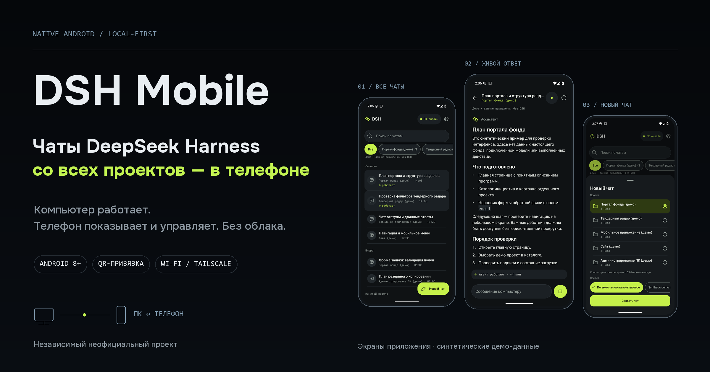
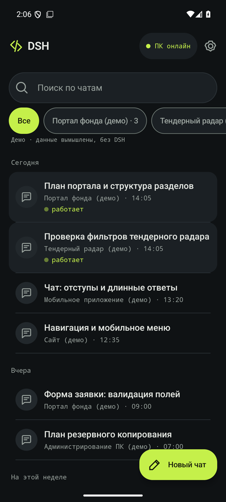
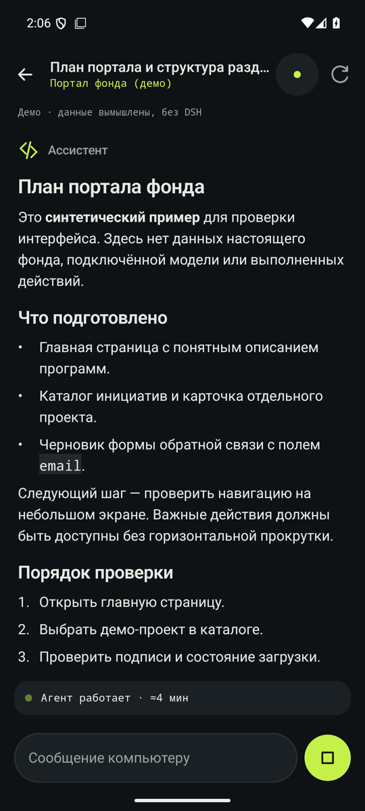
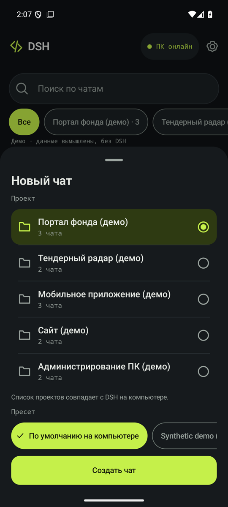

<p align="center">
  
</p>

# DSH Mobile

**Нативное Android-приложение для [DeepSeek Harness](https://github.com/deepseek-ai/deepseek-harness): открывайте чаты всех проектов и отправляйте задачи с телефона.** Ответы агента обновляются в реальном времени. Модели, инструменты и подписки остаются на компьютере.

<p align="center">
  <a href="https://github.com/pavel-logachev/dsh-mobile/releases/tag/v0.4.0">Скачать APK 0.4.0</a> &nbsp;·&nbsp;
  <a href="docs/SETUP.md">Установка</a> &nbsp;·&nbsp;
  <a href="docs/ARCHITECTURE.md">Архитектура</a> &nbsp;·&nbsp;
  <a href="docs/SECURITY.md">Безопасность</a> &nbsp;·&nbsp;
  <a href="https://github.com/pavel-logachev/dsh-mobile/actions/workflows/ci.yml">CI</a> &nbsp;·&nbsp;
  Android 8+ &nbsp;·&nbsp;
  <a href="LICENSE">MIT</a> &nbsp;·&nbsp;
  <a href="#english">English</a>
</p>

> Версия 0.4 работает у автора на телефоне с его DSH. Проект неофициальный, разрабатывается независимо от DeepSeek.

## Что умеет

- Телефон показывает тот же список проектов, что боковая панель DSH, в том же порядке. Новый проект появляется сам, без повторной привязки.
- Чаты можно искать, фильтровать по проекту и группировать: «Сегодня / Вчера / На неделе». При создании чата выбираются проект и пресет. Из чата можно отправить текстовую задачу или остановить выполнение.
- Ответ агента отображается в Markdown с заголовками, списками, таблицами и блоками кода, которые можно копировать.
- Если сеть пропала во время отправки, приложение сверит статус задачи с компьютером перед повторной отправкой.
- Для привязки компьютер показывает одноразовый QR-код, который сканирует телефон. Камера запрашивается только на время сканирования, распознавание идёт без сети и без сервисов Google.
- Есть тёмная и светлая темы, русский и английский интерфейс, крупный шрифт.

<p align="center">
  
  
  
</p>
<p align="center"><sub>Настоящие снимки экрана приложения с синтетическими демо-данными: реальных чатов и моделей здесь нет.</sub></p>

## Как это устроено

```text
Android-приложение ──HTTPS (Wi‑Fi или Tailscale)──▶ плагин-компаньон внутри DSH ──▶ ваши проекты и агенты
                    └─ или через ваш собственный relay (опционально)
```

На компьютере в DSH устанавливается небольшой плагин-компаньон. Он даёт привязанным телефонам доступ к ограниченному API через защищённое соединение. Сам веб-интерфейс DSH наружу не публикуется. Телефон проверяет компьютер по закреплённому сертификату из приглашения, а у каждого телефона свой ключ и свои права, которые можно отозвать.

## Установка

Пошаговую инструкцию [docs/SETUP.md](docs/SETUP.md) можно передать своему агенту DSH. По ней агент проверит версии, установит плагин и запросит согласие перед каждым важным действием. Основные шаги:

1. Проверьте требования: Windows, DeepSeek Harness `0.2.0-rc.2` или `0.2.1-alpha.1`, Node.js 24, OpenSSL 3, Android 8.0+.
2. Скачайте из [Releases](https://github.com/pavel-logachev/dsh-mobile/releases/latest) подписанный APK, архив плагина `dsh-mobile-host-<версия>.zip` и их файлы `.sha256`. Сверьте контрольные суммы.
3. Установите плагин: запустите `install-host.ps1` из архива и укажите адрес компьютера (IP в домашней сети или имя в Tailscale). Скрипт сначала только готовит конфигурацию, а подключает плагин к DSH отдельным шагом `-Activate`, без перезапуска DSH.
4. Разрешите доступ: чтение всех проектов и, если хотите, запуск задач. Правило брандмауэра Windows добавляется только для частной сети и только с вашего согласия.
5. Установите APK на телефон. Android попросит разрешить установку из этого источника.
6. Привяжите телефон: на компьютере `pair --qr`, в приложении «Сканировать QR-код», затем сверьте адрес и отпечаток сертификата и подтвердите.

Для подключения вне дома поставьте [Tailscale](https://tailscale.com/) на компьютер и телефон и укажите при установке имя компьютера в tailnet. Это бесплатно, роутер настраивать не нужно. Если Tailscale не подходит, можно настроить свой relay на VPS: [RELAY_DEPLOYMENT.md](docs/RELAY_DEPLOYMENT.md). Общего публичного relay проект не предоставляет.

## Безопасность

- Плагин работает внутри DSH с теми же правами, что и сам DSH на вашем компьютере. Фильтрация по проектам не создаёт песочницу. Агент DSH с телефона может делать всё то же, что и с компьютера. Права на запуск задач давайте только своим доверенным устройствам.
- Приглашение одноразовое и живёт не дольше 15 минут. Передавайте его только напрямую: QR-кодом с экрана своего компьютера или файлом по доверенному каналу.
- Ключи телефона хранятся в Android Keystore и не попадают в резервные копии. Ключи компьютера лежат в профиле пользователя Windows с доступом только для владельца.
- Relay, если вы его используете, пересылает зашифрованный трафик и не видит содержимое чатов. Но он видит IP-адреса, время и объём трафика.

Подробности в [SECURITY.md](docs/SECURITY.md).

## Сборка из исходников

```powershell
cd host;  npm ci; npm run check            # плагин-компаньон, Node 24
cd ..\android
powershell -NoProfile -ExecutionPolicy Bypass -Command "& ../tools/android-build.ps1 -Tasks ':app:assembleDebug', ':app:testDebugUnitTest', ':app:lintDebug'"
```

Нужны JDK 21, Android SDK platform 36 и build-tools 36.0.0. Сборка релиза, подпись своим ключом и упаковка плагина описаны в [BUILD.md](docs/BUILD.md) и [ANDROID_RELEASE.md](docs/ANDROID_RELEASE.md).

## Проверки

| Часть | Что проверяется |
|---|---|
| Плагин | 85 тестов: права устройств, отзыв, повторная доставка, гонки при смене проектов. Изолированные прогоны на настоящем DSH обеих поддерживаемых версий |
| Установщик | 28 сценариев на синтетическом профиле: подготовка, активация, обновление, откат, удаление, сохранение байтов профиля |
| Android | 142 JVM-теста, lint; регрессионная приёмка и снимки экранов на эмуляторе |
| Релиз | В APK только три разрешения: интернет, камера и внутреннее служебное. Никакой телеметрии и сервисов Google |

## Ограничения

- Компьютер и DSH должны быть включены. Push-уведомлений и фоновой связи нет: откройте приложение, чтобы увидеть результат.
- Пока не поддерживаются вложения, ответы на вопросы агента и подтверждения действий: их нужно делать на компьютере.
- Один привязанный компьютер на приложение. В списке до 100 проектов.
- Поддерживаются только проверенные версии DSH. После обновления DSH плагин откажется запускаться, пока совместимость не проверят заново.

## Документация

[Установка](docs/SETUP.md) · [Архитектура](docs/ARCHITECTURE.md) · [Протокол](docs/PROTOCOL.md) · [Безопасность](docs/SECURITY.md) · [Интеграция с DSH](docs/DSH_INTEGRATION.md) · [Relay](docs/RELAY_PROTOCOL.md) · [Сборка](docs/BUILD.md) · [Дизайн](docs/DESIGN.md) · [Участие](CONTRIBUTING.md)

<a id="english"></a>

## English

DSH Mobile is an unofficial native Android app for DeepSeek Harness, developed independently. It shows chats from every registered DSH project. You can create a chat, send a text task, read live Markdown replies or stop running work. Models, tools, subscriptions and history stay on your computer.

A companion plugin runs inside DSH and gives paired phones access to a limited API over TLS. The phone pins the computer’s certificate. Pairing uses a one-use QR invitation; scanning works offline without Google Play services. You can connect over the same Wi‑Fi, over Tailscale or through your own relay.

Supported DSH versions are `0.2.0-rc.2` and `0.2.1-alpha.1`. You can give the [setup runbook](docs/SETUP.md) to your DSH agent. Project filtering does not create a sandbox. Push notifications, attachments and approvals are not supported yet.

## Лицензия

[MIT](LICENSE) © 2026 Pavel Logachev. Сторонние зависимости распространяются под своими лицензиями.
