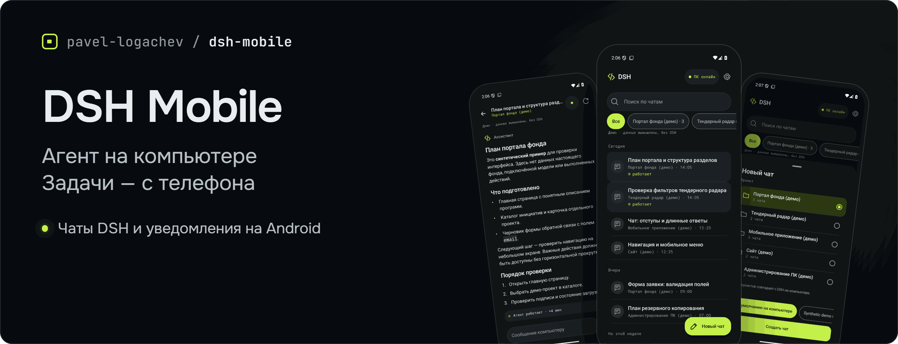
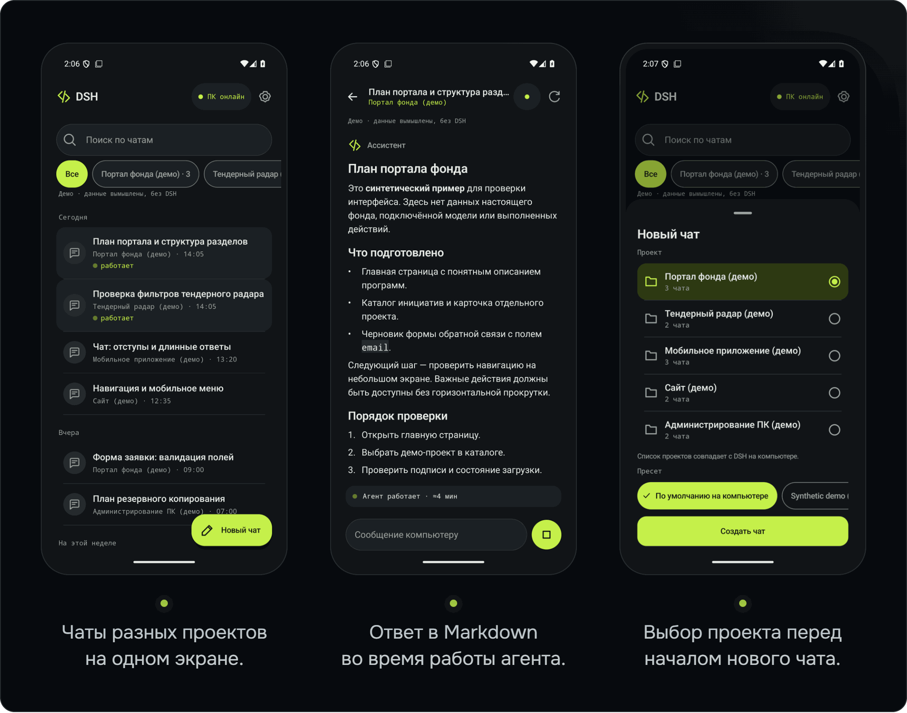

<picture><source media="(max-width: 767px)" srcset="docs/assets/dsh-mobile-banner-mobile.png"></picture>

# DSH Mobile

**Ваш агент [DeepSeek Harness](https://github.com/deepseek-ai/deepseek-harness) работает на компьютере. С Android-телефона вы ставите задачи, читаете ответы в реальном времени и получаете уведомление «Ответ готов».**

[Скачать APK 0.5.0](https://github.com/pavel-logachev/dsh-mobile/releases/tag/v0.5.0) · [Установка](#установка) · [Архитектура](#как-это-устроено) · [Безопасность](#безопасность) · [English](#english)

> Неофициальный проект Павла Логачева. Разрабатывается независимо от DeepSeek.

Android 8.0+ · Привязка по QR-коду · Wi‑Fi или Tailscale

Модели, инструменты и подписки остаются на компьютере. Облачного сервера у DSH Mobile нет.

## Что можно делать с телефона

- **Открывать чаты всех проектов.** Искать чаты и фильтровать по проекту. Список проектов следует боковой панели DSH и обновляется без повторной привязки.
- **Ставить задачи.** Создать чат, выбрать проект и пресет, отправить текст.
- **Читать ответ в реальном времени.** Markdown, таблицы, блоки кода с копированием. Служебные события свёрнуты в строку «Действия агента» — полный текст доступен по нажатию.
- **Дописывать, пока агент работает.** Сообщение встанет в очередь DSH и дойдёт до агента на следующем шаге.
- **Останавливать работу.** Отдельная кнопка «Стоп» запрашивает подтверждение.
- **Получать уведомления.** «Ответ готов» и «Агент ждёт вашего решения» включаются по желанию; отдельные проекты и чаты можно отключить.
- **Возвращаться к переписке.** Поиск по сообщениям, черновик для каждого чата и копирование по долгому нажатию.

Есть светлая и тёмная тема, русский и английский интерфейс, поддержка крупного шрифта.

<picture><source media="(max-width: 767px)" srcset="docs/assets/dsh-mobile-screens-mobile.png"></picture>

Снимки сделаны в настоящем приложении с синтетическими демо-данными. Реальных чатов и подключённых моделей на них нет.

## Как это устроено

На компьютере устанавливается плагин-компаньон. Он открывает привязанному телефону узкий API через защищённое соединение, но не публикует наружу веб-интерфейс DSH.

```text
Android-приложение
  │ HTTPS по Wi‑Fi или Tailscale
  │ или через ваш собственный relay
  ▼
Плагин-компаньон внутри DSH
  │
  ▼
Ваши проекты и агенты на компьютере
```

Телефон — только клиент: агент продолжает работать и после закрытия приложения. Основная история переписки хранится в DSH на компьютере.

Android-клиент написан на Kotlin и Jetpack Compose, плагин работает на Node.js. Собственный relay — необязательный вариант подключения; общего публичного relay проект не предоставляет.

## Установка

Подробную [инструкцию установки](<docs/SETUP.md>) можно передать своему агенту DSH. В ней — проверки окружения, команды и отдельное согласование установки, прав доступа и активации.

1. **Проверьте требования.**

   Компьютер: Windows, DeepSeek Harness `0.2.0-rc.2` или `0.2.1-alpha.1`, Node.js 24.x, OpenSSL 3. Телефон: Android 8.0 или новее. Node 24 нужен и процессу DSH, внутри которого работает плагин, — одной подходящей версии в PATH недостаточно.

2. **Скачайте и проверьте файлы релиза.**

   Из [релиза 0.5.0](https://github.com/pavel-logachev/dsh-mobile/releases/tag/v0.5.0) нужны подписанный APK, архив `dsh-mobile-host-<version>.zip` и их файлы `.sha256`. Все файлы должны быть из одного релиза. `UNSIGNED-verification.apk` — проверочный артефакт, не файл для установки.

   Укажите абсолютные пути к скачанным файлам и сравните хеши с `.sha256`. При несовпадении остановитесь.

   ```powershell
   $zip = '<ABSOLUTE_DOWNLOADED_HOST_ZIP>'
   $apk = '<ABSOLUTE_DOWNLOADED_SIGNED_APK>'
   (Get-FileHash -LiteralPath $zip -Algorithm SHA256).Hash.ToLowerInvariant()
   (Get-FileHash -LiteralPath $apk -Algorithm SHA256).Hash.ToLowerInvariant()
   # Compare exactly with the release's .sha256 files. A mismatch means STOP.
   ```

3. **Подготовьте плагин на компьютере.**

   Извлеките из архива и прочитайте [установщик](<tools/install-host.ps1>). В командах ниже замените заполнители: путь к скрипту и адрес компьютера в домашней сети или Tailscale. Если дополнительный адрес не нужен, удалите второй элемент массива.

   ```powershell
   $installer = '<ABSOLUTE_REVIEWED_INSTALL_HOST_PS1>'
   $hosts = @('<ACTUAL_PRIMARY_LAN_OR_TAILSCALE_HOST>', '<OPTIONAL_ADDITIONAL_SAN>')
   # Remove the second element if not needed. Substitute approved real values locally.
   & $installer -ZipPath $zip -Hosts $hosts -WhatIf
   & $installer -ZipPath $zip -Hosts $hosts
   ```

   Этот шаг готовит файлы и конфигурацию, но ещё не подключает плагин к DSH.

4. **Активируйте плагин.**

   После проверки предлагаемых изменений:

   ```powershell
   & $installer -ZipPath $zip -Hosts $hosts -Activate
   ```

   Установщик не перезапускает DSH. Если плагин не запустился, следуйте диагностике в [инструкции](<docs/SETUP.md>): перезапуск может потребоваться, но согласуется отдельно.

   Если для домашнего Wi‑Fi нужно правило брандмауэра Windows, добавляйте его только с согласия владельца и только для частной сети. Установщик не меняет брандмауэр автоматически.

5. **Установите APK на телефон.**

   Разрешите Android установку из выбранного источника. После установки отключите это разрешение.

6. **Привяжите телефон по QR-коду.**

   На компьютере укажите каталог установленной версии плагина и проверьте конфигурацию:

   ```powershell
   $plugin = '<EXACT_LOCALAPPDATA_DSHMOBILE_PLUGIN_VERSION_DIRECTORY>'
   $cli = Join-Path $plugin 'dist/cli.js'
   $config = Join-Path $env:LOCALAPPDATA 'DSHMobile/host/host.json'
   node $cli verify-config --config $config
   ```

   Затем выберите **одну** команду привязки. Только чтение всех текущих и будущих проектов:

   ```powershell
   node $cli pair --config $config --read all --ttl 300 --qr
   ```

   Или чтение **и запуск задач** во всех этих проектах — только если вы согласны дать телефону такие права:

   ```powershell
   node $cli pair --config $config --read all --execute all --ttl 300 --qr
   ```

   В приложении нажмите «Сканировать QR-код», сверьте адрес компьютера и отпечаток сертификата, затем подтвердите привязку. Камера нужна только для сканирования; код распознаётся без сети и без сервисов Google.

**Для работы вне дома** установите Tailscale на компьютер и телефон, подключите их к своей сети Tailscale и укажите имя компьютера при подготовке плагина. Открывать порт на роутере не нужно. Альтернатива — [собственный relay на VPS](<docs/RELAY_DEPLOYMENT.md>).

**Обновление с 0.4.0:** подписанный тем же ключом APK устанавливается поверх с сохранением привязки. Плагин обновляется установщиком из нового архива; порядок обновления и отката описан в [инструкции](<docs/SETUP.md>).

## Безопасность

- **Права агента остаются прежними.** Плагин работает внутри DSH с его правами. Фильтр по проектам — не песочница: агент с телефона может делать то же, что и с компьютера. Право запуска задач давайте только доверенным устройствам.
- **Приглашение — секрет.** QR-код одноразовый и действует не дольше 15 минут. Не публикуйте его, не отправляйте в чат и не сохраняйте в общие журналы. При привязке проверяются сертификат компьютера, его срок действия, адрес и закреплённый отпечаток.
- **Ключи провайдеров не передаются на телефон.** Данные привязки защищены Android Keystore и исключены из резервных копий. Приватные файлы плагина на Windows доступны только владельцу учётной записи.
- **Потерянный телефон нужно отозвать на компьютере.** Локальный выход из приложения удаляет данные привязки с телефона, но не означает отзыв доступа на стороне DSH.
- **Уведомления не содержат текста ответа.** В них только названия проекта и чата; на экране блокировки — только «Ответ готов».
- **Relay не видит содержимое чатов.** Он пересылает зашифрованный трафик, но видит IP-адреса, время и объём передачи.

Не публикуйте наружу веб-порт DSH и не отключайте проверку TLS. Подробнее — в [описании безопасности](<docs/SECURITY.md>).

## Сборка из исходников

Из корня репозитория, в PowerShell:

```powershell
cd host;  npm ci; npm ci --prefix ../relay; npm run check   # плагин-компаньон, Node 24; тестам нужен соседний relay
cd ..\android
powershell -NoProfile -ExecutionPolicy Bypass -Command "& ../tools/android-build.ps1 -Tasks ':app:assembleDebug', ':app:testDebugUnitTest', ':app:lintDebug'"
```

Рекомендуется JDK 21; Windows-помощник также поддерживает JDK 17. Нужны Android SDK platform 36 и build-tools 36.0.0.

Обычная release-сборка APK не подписана и не устанавливается как есть. Сборка, упаковка плагина и подпись своим ключом описаны в [инструкции по сборке](<docs/BUILD.md>) и [инструкции выпуска APK](<docs/ANDROID_RELEASE.md>).

## Проверки релиза 0.5.0

| Часть | Что проверено |
|---|---|
| Android | 190 JVM-тестов, 9 UI-тестов на эмуляторе, lint без ошибок |
| Плагин | 121 тест: права и отзыв доступа, повторная доставка, смена проектов, уведомления и восстановление. Нагрузка на 600 неактивных чатов |
| Совместимость с DSH | Изолированные прогоны на настоящем DSH `0.2.0-rc.2` и `0.2.1-alpha.1` |
| Установщик | 28 сценариев на синтетическом профиле: подготовка, активация, обновление, откат, удаление и сохранность байтов профиля |
| Сквозная проверка | Эмулятор с изолированным DSH: очередь и «Стоп», уведомления в фоне и Doze, переход в нужный чат, приватность экрана блокировки, переподключение после перезапуска плагина |
| Разрешения APK | Интернет, камера, внутреннее служебное; уведомления и фоновая служба — только при включённых уведомлениях. Без телеметрии и сервисов Google |

## Ограничения

- **Компьютер и DSH должны быть включены.** Телефон не запускает агента автономно.
- **Уведомления зависят от фонового соединения.** Пока они включены, в шторке видна запись «DSH Mobile на связи». После перезагрузки телефона или принудительной остановки приложение нужно открыть снова.
- **Проверка уведомлений пока только на эмуляторе.** На реальном телефоне они ещё не проверены; экономия батареи у некоторых производителей может задерживать доставку. Push через UnifiedPush — в планах.
- **Вложения, ответы на вопросы агента и подтверждения действий — на компьютере.** Уведомление о запросе решения не означает, что ответить на него можно с телефона.
- **Одна привязка — один компьютер.** В списке учитываются первые 100 зарегистрированных проектов.
- **Обновление DSH требует проверки совместимости.** Плагин сверяет версию из своих настроек, а не фактически установленную. Поддерживаются только указанные выше проверенные версии.
- **Обрыв связи не означает, что задача не отправлена.** Приложение сверяет её статус с компьютером. Если доставка осталась неопределённой, проверьте результат на компьютере, прежде чем отправлять задачу заново.

## Документация

- [Установка, обновление и удаление](<docs/SETUP.md>)
- [Архитектура](<docs/ARCHITECTURE.md>)
- [Протокол мобильного клиента](<docs/PROTOCOL.md>)
- [Безопасность](<docs/SECURITY.md>)
- [Интеграция с DSH](<docs/DSH_INTEGRATION.md>)
- [Развёртывание своего relay](<docs/RELAY_DEPLOYMENT.md>) и [его протокол](<docs/RELAY_PROTOCOL.md>)
- [Сборка из исходников](<docs/BUILD.md>)
- [Подпись и выпуск Android APK](<docs/ANDROID_RELEASE.md>)
- [Участие в проекте](<CONTRIBUTING.md>)

## English

DSH Mobile is an unofficial Android client for DeepSeek Harness, developed independently of DeepSeek. Your agent runs on your computer; your phone lets you browse chats across projects, send text tasks, follow live Markdown replies, add a message while the agent is working and stop a run. Optional notifications tell you when an answer is ready. Models, tools, subscriptions and canonical history stay on the computer.

Pair with a one-use QR code and connect over Wi‑Fi, Tailscale or your own optional relay. DSH Mobile provides no hosted cloud server or shared relay. A companion plugin exposes a narrow HTTPS API, not the DSH web UI. The phone verifies the computer's pinned certificate, and each device has revocable permissions. Project filtering is not a sandbox: agents retain their desktop tool permissions.

Requires Android 8.0+, Windows, DSH `0.2.0-rc.2` or `0.2.1-alpha.1`, Node.js 24.x and OpenSSL 3. [Download the signed APK and host package](https://github.com/pavel-logachev/dsh-mobile/releases/tag/v0.5.0) and follow the [setup guide](<docs/SETUP.md>), or give it to your DSH agent. The computer must remain on. Notifications use an opt-in foreground connection without Google services; physical-phone notification delivery has not yet been verified. Attachments, answers to agent questions and approvals still require the desktop.

## Лицензия

[MIT](<LICENSE>) © 2026 Pavel Logachev. Сторонние зависимости распространяются под своими лицензиями.
